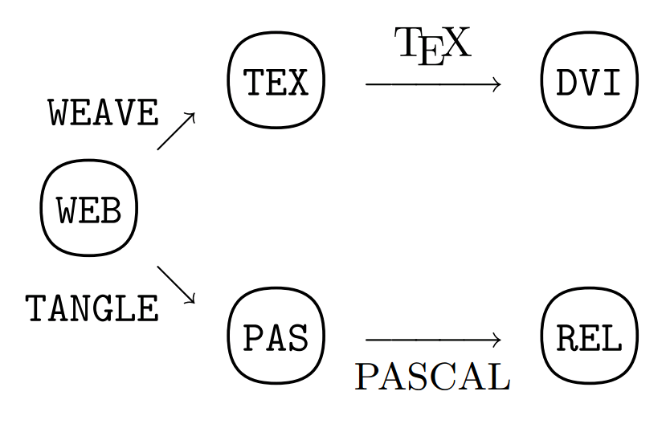

## Topics

- Open and Reproducible
- Rmarkdown
- Sweave (.Rnw)

## F/OSS

- 1980 copyright law was extended to computer programs
- 1985 Free Software Foundation was founded

    Stallman, Richard (1985) "The GNU Manifesto", _Dr. Dobb's Journal_ 10(3):30
    
- 1992 Linux kernel re-licensed under GNU GPL
- 1995 Apache was released under Apache License
- 1998 Open Source Initiative founded; Netscape source was released

    Raymond, Eric (1997) _The Cathedral and the Bazaar_

## Stallman (1985)

- <small>"GNU, which stands for Gnu's Not Unix, is the name for the complete Unix-compatible software system which I am writing so that I can give it away free to everyone who can use it. ... Software sellers want to divide the users and conquer them, making each user agree not to share with others. I refuse to break solidarity with other users in this way. I cannot in good conscience sign a nondisclosure agreement or a software license agreement."</small>

- <small>"GNU is not in the public domain. Everyone will be permitted to modify and redistribute GNU, but no distributor will be allowed to restrict its further redistribution. That is to say, proprietary modifications will not be allowed. I want to make sure that all versions of GNU remain free."</small>

## Raymond (1997)

- <small>"Linus Torvalds's style of development -- release early and often, delegate everything you can, be open to the point of promiscuity -- came as a surprise. No quiet, reverent cathedral-building here -- rather, the Linux community seemed to resemble a great babbling bazaar of differing agendas and approaches (aptly symbolized by the Linux archive sites, who'd take submissions from anyone) out of which a coherent and stable system could seemingly emerge only by a succession of miracles."</small>

- <small>"Chance handed me a perfect way to test my theory, in the form of an open-source project that I could consciously try to run in the bazaar style. So I did -- and it was a significant success."</small>

## Quiz

Which organization is most closely related to the following quote?

> "free" as in "free speech," not as in "free beer"

1. Open Source Initiative (OSI)
2. International Council for Science (ICSU)
3. Organisation for Economic Co-operation and Development (OECD)
4. Free Software Foundation (FSF)

## Motivation for Reproducibility

"An article about computational science in a scientific publication is _not_ the scholarship itself, it is merely _advertising_ of the scholarship. The actual scholarship is the complete software development environment and the complete set of instructions which generated the figure."

Buckheit and Donoho (1995)'s distillation of Claerbout and Karrenbach (1992)'s insight

## Replication vs Reproducible Research

- "The ultimate standard for strengthening scientific evidence is _replication_ of findings and conducting studies with independent: Investigators, Data, Analytical methods, Laboratories, Instruments."

- "Reproducible Research: Make analytic data and code available so that others may _reproduce_ findings."

<small>Peng, Roger. "Reproducible Research: Concepts and Ideas" Lecture note for the Coursera Course titled, _Reproducible Research_. https://github.com/rdpeng/courses/. accessed on 2014-12-24.</small>

## Research Pipeline


<small><small><small>Peng, Roger (2011) "Computational and Policy Tools for Reproducible Research" presentation at _Reproducible Research: Tools and Strategies for Scientific Computing_, a workshop in association with Applied Mathematics Perspectives 2011, University of British Columbia, Vancouver, BC, Canada. July 13-16, 2011. page 6.</small></small></small>

## Quiz

Indicate if the following statement is True or False.

1. According to Roger Peng, Replication of the scientific findings by independent investigators using independent methods, data, instruments, and laboratories is the standard method by which scientific findings are verified and is how knowledge is accumulated. (T/F)

2. Replication is always possible. (T/F)

3. In Roger Peng's Research Pipeline, the processing code transforms Measured Data into Analytic Data. (T/F)

## Knuth (1984)

- "I believe that the time is ripe for significantly better documentation of programs, and that we can best achieve this by considering programs  to be works of literature. Hence, my title: 'Literate Programming.'"

- "By coining the phrase 'literate programming,' I am imposing a moral commitment on everyone who hears the term; surely nobody wants to admit writing an illiterate program."

<small><small>Donald E. Knuth. Literate programming.
The Computer Journal, 27(2):97-111, May 1984. http://comjnl.oxfordjournals.org/content/27/2/97.full.pdf+html. Accessed on 2014-12-24.</small></small>

## Knuth (1984)

- "WEB itself is chiefly a combination of two other languages: (1) a document formatting language and (2) a
programming language. ... The main point is that WEB
is inherently bilingual, and that such a combination of
languages proves to be much more powerful than either
single language by itself."



Donald E. Knuth. Literate programming.
The Computer Journal, 27(2):97-111, May 1984. http://comjnl.oxfordjournals.org/content/27/2/97.full.pdf+html. Accessed on 2014-12-24.

## Xie, Yihui (2014). Basic Idea (of RMarkdown)

- code + narratives = report
    i.e. computing languages + authoring languages

<pre class='prettyprint lang-r'><code>We built a linear regression model.

&#96;&#96;&#96;{r}
fit <- lm(dist ~ speed, data = cars)
b   <- coef(fit)
plot(fit)
```

The slope of the regression is &#96;r b[1]`.</pre></code>

## R Markdown overview

- an authoring format that combines text (formatted in markdown) and code chunks and inlined expressions

- also a R package at CRAN
```r
library(rmarkdown)
render('your.Rmd')
```
- above will take the `your.Rmd` file and: (1) the code chuncks and inlined expressions are processed (run) and put back into the markdown document (by knitr); and it is converted into a HTML document (by pandoc)

## Creating and rendering a new .rmd

- in RStudio, File > New File > R Markdown...
- fill out the Title and Author and click on OK


- make any changes, save, and click on Knit HTML to render.

## Try R Markdown

Create a new .rmd file and try to:

1. add a sentence
2. make some words **bold**
3. put some headers    
4. put the initial "OPR" and make it a link pointing to OPR web site 
5. put the OSI logo using the image url: http://opensource.org/files/garland_logo.png
6. make an unordered list
7. make a table

(See the R Markdown cheat sheet)

## Code chunk

<pre><code>&#96;&#96;&#96;{r}
# some R code
v <- 1:5
w <- v - 2
w
```</code></pre>
    
- When _knit_ (i.e., processed by knitr), we see code and output:

```{r}
# some R code
v <- 1:5
w <- v - 2
w
```

## Code chunk options

<pre><code>&#96;&#96;&#96;{r my_chunk, echo=FALSE, results="hide"}</code></pre>

<pre><code>&#96;&#96;&#96;{r scatter, fig.width=8, fig.height=6}</code></pre>

- global options

<pre><code>&#96;&#96;&#96;{r first, include=FALSE}
library(knitr)
opts_chunk$set(fig.width=12, fig.height=8,
    error=TRUE, warning=TRUE, message=TRUE, 
    cache=TRUE)
```</code></pre>

## Challenge

- Create or modify a R Markdown (.rmd) file. Create a plot and change the size by using chunk options. Show the code that produces the plot.

- Hint: read about all the knitr chunk options at:
    <http://yihui.name/knitr/options#chunk_options>

## Inline Expression

- inline r expression is like this:
    <pre><code>The sum of one, two, and three is &#96;r 1 + 2 + 3&#96;.</code></pre>
    
- which will be shown as:

    <pre><code>The sum of one, two, and three is `r 1 + 2 + 3`.</code></pre>
  
## Another Inline Expression example

```{r, include=F}
fmt <- function(x, decimalPlaces=4) format(round(x, decimalPlaces), nsmall=decimalPlaces)
```
```{r}
fit <- lm(dist ~ speed, data=cars)
b <- coef(fit)
p <- summary(fit)$coefficients[,"Pr(>|t|)"]
```

- we can write a text like:
    <small><pre><code>The coefficient of the speed variable is &#96;r b['speed']&#96; with
the p-value of &#96;r p['speed']&#96;.</code></pre></small>
    
- which will be shown as:
    <small><pre><code>The coefficient of the speed variable is `r fmt(b['speed'])` with
the p-value of `r fmt(p['speed'])`.</code></pre></small>
    
## Regression Table

<small><pre><code>&#96;&#96;&#96;{r, results="asis"}
fit <- lm(dist ~ speed, data=cars)
library(knitr)
kable(summary(fit)$coef, format="html", digits=4)
&#96;&#96;&#96;</code></pre></small>

```{r, results="asis", echo=F}
fit <- lm(dist ~ speed, data=cars)
library(knitr)
kable(summary(fit)$coef, format="html", digits=4)
```

<br/><br/>
check out other packages including: xtable and texreg    
    
## Rendering options - YAML header

- title, author, date
- output type:
    - html\_document
    - pdf\_document
    - word\_document
    - beamer\_presentation (pdf)
    - ioslides\presentation (html5)
    - and more
- there are output specific options as well. See all the options in the rmarkdown package documentation:
<http://cran.r-project.org/web/packages/rmarkdown/rmarkdown.pdf>

## Numbered sections and table of contents (HTML)

<pre><code>---
title: "Test"
author: "Chang Y. Chung"
date: Dec. 31, 2014
output:
  html_document:
    toc: true
    toc_depth: 4
    number_sections: true
---</code></pre>

## R Sweave file (.Rnw)

- Is a file with your source text markedup with LaTeX

- Code chunks

<pre><code><< myChunk, options... >>=
  ... r code
@</code></pre>
  
- Inlined Expressions
  
<pre><code>\Sexpr{ your expression here }</code></pre>
  
- An example (demonstration)

## Q & A

- any questions?
