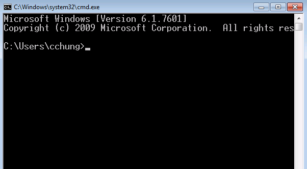
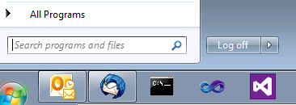
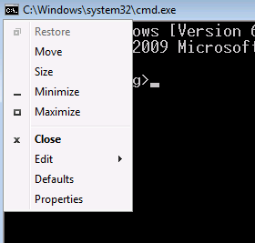
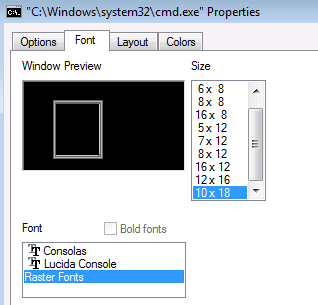

## Topics

- cmd.exe (terminal window)
- gnu make utility
- packrat

## Meet cmd.exe

- click on the windows "Start" button
- click on the "Search programs and files" input box
- type in "cmd" and press the enter key

<br/>
<br/>


## Change font size

- click on the icon on top left corner of the cmd window
- click on the property menu at the bottom
- click on the font tab and change the font size

   

## Some DOS (UNIX) commands

- cd (pwd): show current working directory
- cd (cd): change directory

- dir (ls): list files in the directory (folder)
- copy (cp): copy a file
- del (rm): delete a file

- mkdir (mkdir): create subdirectories
- rmdir (rmdir): remove subdirectories

- type (cat): show file contents
- echo (echo): display message
- help (man): show help

- start (open): open the default application for the file

## Demonstration

1. change directory into where we created the test.Rmd
2. will convert test.Rmd into test.html using rscript command
3. open test.html using "start" command

## Challenges

1. what is your current working directory?
2. how many files in your current working directory?
3. check the files against what the windows explorer is showing.

4. change directory to where you have your test.rmd file
5. see the file contents of the test.rmd
6. convert test.rmd to test.html using rscript command
7. open test.html in the default browser using start command

8. modify test.rmd in some way an do the above steps 6 and 7 again.

## Let's take a break

Any questions, so far?

## Let's create two .Rmd files

- makeDf.Rmd: which saves a data frame in df.Rds
- report.Rmd: which load df.Rds and draw a picture

```{r eval=F}
# makeDf.Rmd
df <- data.frame(x=1:5, y=seq(2,10,2))
saveRDS(df, file="df.Rds")
```

```{r eval=F}
# report.Rmd
df <- loadRDS("df.Rds")
plot(df$x, df$y)
```

## From workflow to file dependencies

- work process

makeDf.Rmd -> df.Rds -> report.Rmd -> report.html


- file dependencies

report.html depends on report.Rmd and df.Rds; df.Rds depends on makeDf.Rmd

## Make

- Created by Stuart Feldman in 1977. Feldman Received the 2003 ACM Software System Award for it.

- Make controls the generation of executables and other non-source files of a program from the program's source files.

- Make gets its knowledge of how to build your program from a file called the *makefile*, which lists each of the non-source files and how to compute it from other files.

<!--
- Make works in two steps: first time it constructs directed acyclic graph(s) of dependencies among the files. The dependency graph(s) along with file timestamps are used to figure out which targets should be updated; second time, it runs the recipies of the targets that should be updated, in the neccessary order, given by the dependency graph(s).
-->

## makefile example

```{r, eval=F}
all: report.html

report.html: report.Rmd df.Rds
	rscript -e "library(rmarkdown); render('report.Rmd')"

df.Rds: makeDf.Rmd
	rscript -e "library(rmarkdown); render('makeDf.Rmd')"

clean:
	del df.Rds
	del makeDf.html
```
<!--
- a _rule_ in the makefile tells Make how to execute a series of recipes (commands) in order to build a target from dependencies.
-->

<pre>
target : prerequisites ...
(TAB)    recipe
         ...
</pre>

## Demonstration

Running Make

## Quiz

```{r, eval=F}
mypaper.pdf: mypaper.bib mypaper.tex fig1.pdf fig2.pdf
    pdflatex mypaper
    bibtex mypaper
    pdflatex mypaper
    pdflatex mypaper

fig1.pdf: fig1.R
    rscript --vanilla fig1.R

fig2.pdf: fig2.R
    rscript --vanilla fig2.R
```

Given the above makefile in the currently working directory with no .pdf files at all, how many lines of commands Make will run? (3/4/6/9/depends)

## Frills

- Comment line starts with a pound sign, \#

- Variables can be defined

```{r eval=F}
# define common R options
opt = --vanilla --no-save --no-restore

fig1.pdf: fig1.R
    rscript ${opt} fig1.R

fig2.pdf: fig2.R
    rscript ${opt} fig2.R
```

## Automatic variables

```{r eval=F}
$@ target filename
$< name of the first prerequisite
$^ all prerequisites
```

as in

```{r eval=F}
fig1.pdf: fig1.R
    rscript $<
```

## Pattern rules

- the percent symbol (\%) can be used as a wildcard characater

```{r eval=F}
%.pdf: rCodeForPDF\%.R
    rscript $<
```

- above will run all the .R files in the rCodeForPDF directory -- which will create a same named .pdf file in the current directory. E.g., if we have:

```{r eval=F}
rCodeForPDF\fig1.R
rCodeForPDF\fig2.R
rCodeForPDF\fig3.R
```

then, we will have, after running Make:

```{r eval=F}
fig1.pdf
fig2.pdf
fig3.pdf
```

## Documentation and other links

- GNU Make manual: <http://www.gnu.org/software/make/manual/>
- Mecklenburg (2014) _Managing Projects with GNU Make, Third Edition_ <http://www.oreilly.com/openbook/make3/book/index.csp>
- Bostock (2013) "Why use make?" <http://bost.ocks.org/mike/make/>
- Jones "GNU Make for Reproducible Data Analysis" <http://zmjones.com/make/>

## Challenge

Create a html report using three files given below.
```{r eval=F}
# makeAna.R
saveRDS(data.frame(x=1:5, y=seq(3,15,3)), file='ana.Rds')
```

```{r eval=F}
# fig1.R
df <- readRDS('ana.Rds')
pdf('images/fig1.png'); plot(df$x, df$y); dev.off()
```

<pre class='prettyprint lang-r'><code>---
output: html_document
---
# fig2.Rmd
&#96;&#96;&#96;{r}
df <- readRDS('ana.Rds')
png('images/fig2.png'); plot(df$x, df$y); lines(df$x, df$y); dev.off()
```</code></pre>

## (The Other) Dependency

- Reproducibility depends not only on the availability of source and data, but also on accessibility of the computing environment.

- Computing environment can mean specific (combination of): Hardware, OS, application program, installed packages or extensions, etc.

- Computing environment is diverse and it changes. The latter being a reason why reproducibility erodes overtime.

- R Package dependency can be managed by packrat, which basically bundles source code files of the packages (that you are using) within your R project, along with your R files. See <http://rstudio.github.io/packrat/>


## Q & A

Any questions?
