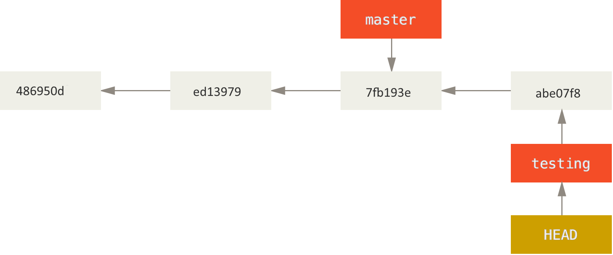

## Topics

- Git
- Github
- Reproducible research check list

## What is git?

- the stupid content tracker

- a fast, scalable, distributed revision control system with an unusually rich command set that provides both high-level operations and full access to internals.

- "I'm an egotistical bastard, and I name all my projects after myself. First 'Linux', now 'git'" --- Linus Torvalds according to "Why the 'Git' name?" item in GitFaq. Accessed at <https://git.wiki.kernel.org/index.php/GitFaq> on Jan, 2015.

## Tracking changes of working file(s) over time 1

- versioning<br/><br/>

- `egsr03.dat`: Egyptian WFS Standard Record Ver 3

## Tracking changes over time 2

- timestamping<br/><br/>

- `504_ideas_2014-05-19T19_04_52Z_public_cleaned.csv`

## Tracking changes over time 3
    
- snapshot: state of a system (here a file) at a particular point in time<br/><br/>

- keep only the latest (current) files in the working directory

- `20141201` directory has the `analysis.Rmd` (and any other files) as was on Dec., 1, 2014

- `20141223` directory has the `anaysis.Rmd` (ditto) as was on Dec., 23, 2014

## More elaborate snapshots strategy

- put all the snapshots under a subdirectory (repo?)
- snapshot names don't have to be date
- "branches" idea<br/><br/> 

## Git as snapshot management system

- each snapshot is called a 'commit'

- Git stores file contents as well as meta-data (file names, who made the snapshot (commit), when, how this snapshot is related to other snapshot, ...)

- Git stores everything under the (hidden) .git directory

- everything in Git is check-summed before it is stored and is then referred to by that checksum (20-byte SHA-1 hash)

- Git generally only adds information -- it is hard to get Git do something undoable or to erase/lose data without Git's knowing

- Git is a distributed system -- everybody has their own local copy of the entire history of a project

## First-time Setup

- open the cmd.exe (terminal) window

- set name and email

```{r eval=F}
git config --global user.name "Mary Smith"
git config --global user.email msmith@example.edu
```

- set text editor

```{r eval=F}
git config --global core.editor nano
```

## Quiz

Open cmd.exe. Set your global user.name and user.email to your choices; and the core.editor to nano.

Once you've done that, what does the following command returns?

```{r eval=F}
git config --global core.editor
```

1. vim
2. chang y. chung
3. cchung@princeton.edu
4. nano

## Demonstration: Initial commit

- will demonstrate the following:
    * create a project directory
    * create a R Markdown file (analysis.Rmd)
    * test run it using rscript
    
- open the windows explorer and cmd.exe window and do:    
    * `git init`
    * `git add analysis.Rmd`
    * `git commit -m 'commit for the first time'`
    
    * `git status` to check the status
    * `git log` to view the history (commits)
    
- try it yourself

## Checking repository status and reviewing project history

- to see where things are at: `git status`
- a new or modified file should be:
    * first staged(cached) using `git add`; and
    * then snapshot by `git commit`
- to see the history (of commits): `git log`

## Quiz

Indicate if the following statement is true or false.

in order to make a snapshot of a new or modified file using Git, we need to get the file:

- first staged (cached) using `git add`; and
- then snapshot by `git commit` 

## Challenge

Create an appropriate `makefile`, and then make another commit with a commit message, "add a makefile"

Once done, then the `git log` should show two commits like so:

```{r eval=F, highlight=F}
commit 6b3f0c8bad195b94c99f658b8182a5fa87d1605f
Author: Chang Y. Chung <chang_y_chung@hotmail.com>
Date:   Wed Jan 7 15:20:02 2015 -0500

    add a makefile

commit e7f3e7bc9220fd552cbe03a0bf89436ea8fe157c
Author: Chang Y. Chung <chang_y_chung@hotmail.com>
Date:   Wed Jan 7 15:09:57 2015 -0500

    commit for the first time
```

## Challenge

- practice another commit
    * Open and edit `analysis.Rmd`. Save. Now `git status` reports that `analysis.Rmd` is not staged.
    * Process it by `make` -- this will overwrite `analysis.html` if exists. Try `git status` again and confirm that the .Rmd file is not staged and the .html file is not tracked. 
    * Issue `git add analysis.*` to stage both the file. Commit with a message, something like "make editorial changes and track html"

- extra
    * Confirm that `git log` now shows three commits.
    * Try options like `git log --oneline`
    * See help using `--help` option like: `git log --help`

## Let's take a break

- any questions?

## See the differences 

- Open the analysis.Rmd and make some changes. I am going to add another sentence on top.

- `git diff analysis.Rmd` shows the differences between the latest working version (not staged yet) and that in the latest commit.

- `git diff --help` shows many different comparisons possible

## Undoing

- Commit too early and possibly forget to add some files: `git commit --amend` and example:

```{r eval=F}
git commit -m 'initial commit'

git add some_file_to_add
git commit --amend
```

- Unstaging a staged (`git add`ed) file: `git reset HEAD file_to_unstage`

- You've modified a file and messed it up. Would like to start over how it was at the last commit: `git checkout -- file_to_revert_back` (See demonstration)

## Branching

- a Git repository with three commits and only one (default) branch, master

```{r eval=F, highlight=F}
> git log --oneline --decorate
7fb193e (HEAD, master) third commit
ed13979 second commit
486950d first commit
> git branch
* master
```


## Create a branch

- `git branch testing`

```{r eval=F, highlight=F}
> git branch testing
> git log --oneline --decorate
7fb193e (HEAD, testing, master) third commit
ed13979 second commit
486950d first commit
```


## Check out a branch

- `git checkout testing` then work as usual, then commit

```{r eval=F, highlight=F}
> git checkout testing
  (modify files)
> git add ...
> git commit -m ...
> git log --oneline --decorate
abe07f8 (HEAD, testing) testing update
7fb193e (master) third commit
ed13979 second commit
486950d first commit
```


## Checkout master

- `git checkout master` bring us back to third commit

```{r eval=F, highlight=F}
> git checkout master
  (modify files)
> git add ...
> git commit -m "update master"
```


## Merge testing branch into master

```{r eval=F, highlight=F}
> git checkout master
> git merge training
Auto-merging myfile.txt
CONFLICT (content): Merge conflict in myfile.txt
Automatic merge failed; fix conflicts and then commit the result.
```
- merge conflict: same part of the file modified differently
```{r eval=F, highlight=F}
> type myfile.txt      | in master             in testing
initial file content   | initial file content  initial file content 
second line            | second line           second line
third line             | third line            third line
<<<<<<< HEAD           | master update         testing update
master update          |
=======                |
testing update         |
>>>>>>> testing        |
```

## Resolve merge conflict

- manually edit conflicting part and remove `<<<<<<<<`, `========`, and `>>>>>>>>` lines completely
- and then stage that file, and commit

```{r eval=F, highlight=F}
  (editing)
> type myfile.txt
initial file content
second line
third line
master and testing updates
> git add myfile.txt
> git commit -m "merged"
[master ad9c757] merged
```
## After merge


## Quiz

Indicate if the following statement is true or false:

1. In version control (VC), branching means "you diverge from the main line of development and continue to do work without messing with that main line" (T/F)

2. A branch in Git is simply a pointer to one of the commits (T/F)

3. If no merge conflicts (i.e., the same part of the same file has been modified differently depending on the branch), Git can merge branches quickly and easily (T/F)

4. Git remote branches are pointers to the branches in remote repositories, e.g. `origin/master` (T/F)

## GitHub

- GitHub is the best place to share code with friends, co-workers, and complete strangers -- <https://github.com/about>

- a web-based Git repository hosting service launched in 2008, founded by Tom Preston-Werner, Chris Wanstrath, and PJ Hyett

- GitHub is like facebook for programmers -- Karl W. Broman
    [hadley](https://github.com/hadley>), [yihui](https://github.com/yihui), [rdpeng](https://github.com/rdpeng), [torvalds](https://github.com/torvalds), [matz](https://github.com/matz), [mbostock](https://github.com/mbostock), [jgm](https://github.com/jgm), ...

## Cloning

- a public repository on GitHub can be easily `clone`d

- get a copy of all the slides for this workshop

```{r eval=F, highlight=F}
cd desktop
git clone https://github.com/Chang-Y-Chung/rr
```

## Push to a GitHub repo

Requirement: a GitHub account (sign up)

```{r eval=F, highlight=F}
> git init
> git add (many files including presentation .rmd and .html)
> git commit -m "initial commit"
> git remote add origin https://github.com/Chang-Y-Chung/rr.git
> git push -u origin master
Username for 'https://github.com':
Password for 'https://chang-y-chung@github.com':
To https://github.com/Chang-Y-Chung/rr.git
 * [new branch]      master -> master
Branch master set up to track remote branch master from origin.
```

## Pull from a GitHub repo

Once set up in the previous slide, pulling down any updates from GitHub gets simple:

```{r eval=F, highlight=F}
> git pull
Already up-to-date.
```

- `git pull` does both `git fetch` and `git merge`

## Pull request

- Creating PR: A potential collaborator
    * makes a copy of a GitHub repo under own GitHub account ("Forking")
    * pull down to local repo
    * create a PR branch and fix a bug or implement a feature
    * push the change back to own GitHub repo and
    * send the original project account a PR

- Reviewing/Accepting PR: Original project owner
    * once received a pull request, review code and documentation
    * if it is OK, then pull from the PR branch of the collaborator's GitHub repo into local master
    * once merged, push it back up to the project GitHub repo

## Creating pull request

- Diagram from Kevin Markham's [simple guide to forks](http://www.dataschool.io/simple-guide-to-forks-in-github-and-git/)<br/> 
- GitHub Help on [Collaborating](https://help.github.com/categories/collaborating/)
- Hadley Wickham's writing on [RStudio, Git and GitHub](http://r-pkgs.had.co.nz/git.html).

## Git/GitHub Learning Resources

- Chacon and Straub (2014) Pro Git. Available at <http://git-scm.com/book/en/v2>
- Karl Broman's tutorials <http://kbroman.org/pages/tutorials.html>
- Gregg Pollack's Try Git video and hands-on at Code School <https://www.codeschool.com/courses/try-git>
- Kevin Markham's YouTube channel <https://www.youtube.com/user/dataschool>


## Reproducible Research Checklist

1. Are we doing good science?
2. Was any part of this analysis done by hand?
3. Have we taught a computer to do as much as possible (i.e. coded)?
4. Are we using a version control system?
5. Have we documented our software environment?
6. Have we saved any output that we cannot reconstruct from original data + code?
7. How far back in the analysis pipeline can we go before our results are no longer (automatically) reproducible?

<small>Roger Peng (2014) "Reproducible Research Checklist" Lecture note for the Coursera Course titled "Reproducible Research". Accessed at <https://github.com/rdpeng/courses> on Jan, 2015.</small>

## Quiz

True or False?

1. If any part of the analysis was done by hand, then the research is not reproducible. (T/F)

2. It is a good idea to call `sessionInfo()` in your R code. (T/F)

3. Always make sure to call `set.seed()`; Feel free to call `date()`. (T/F)

## The End

- Any questions?

- Please fill out the feedback form. Thanks a lot!


